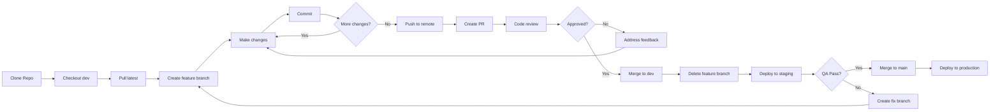

# Git Workflow - Secret Saju

**Version Control & Collaboration Guide**

---

## 🌿 Branch Strategy

### Branch Types

```
main (production)
  ├── dev (staging)
  │   ├── feat/user-name/feature-name
  │   ├── fix/user-name/bug-description
  │   ├── refactor/user-name/what-changed
  │   └── docs/user-name/doc-update
  └── hotfix/critical-bug-fix
```

### Branch Naming Convention

| Type | Format | Example |
|------|--------|---------|
| **Feature** | `feat/name/description` | `feat/john/celebrity-matching` |
| **Bug Fix** | `fix/name/bug` | `fix/sarah/login-redirect` |
| **Refactor** | `refactor/name/what` | `refactor/mike/api-client` |
| **Docs** | `docs/name/doc-name` | `docs/emma/api-docs` |
| **Hotfix** | `hotfix/critical-issue` | `hotfix/payment-crash` |

---

## 🚀 Workflow Steps

### 1. Start New Feature

```bash
# 1. Ensure you're on dev and up-to-date
git checkout dev
git pull origin dev

# 2. Create feature branch
git checkout -b feat/yourname/feature-name

# Example:
git checkout -b feat/john/celebrity-matching
```

---

### 2. Make Changes

```bash
# Work on your code...
# Edit files, add tests, etc.

# Check status
git status

# Add changes
git add .

# Commit with meaningful message
git commit -m "feat: add celebrity matching API endpoint"
```

**Commit Message Convention** (follows [Conventional Commits](https://www.conventionalcommits.org)):

```
<type>: <description>

[optional body]

[optional footer]
```

**Types**:
- `feat`: New feature
- `fix`: Bug fix
- `docs`: Documentation changes
- `style`: Code formatting (no logic change)
- `refactor`: Code restructure (no new features/fixes)
- `test`: Add/update tests
- `chore`: Build process, dependencies

**Examples**:
```bash
git commit -m "feat: add celebrity matching feature"
git commit -m "fix: resolve login redirect issue"
git commit -m "docs: update API documentation"
git commit -m "refactor: extract saju calculation to separate module"
```

---

### 3. Push to Remote

```bash
# First time pushing this branch
git push -u origin feat/yourname/feature-name

# Subsequent pushes
git push
```

---

### 4. Create Pull Request (PR)

**On GitHub**:
1. Go to repository
2. Click "Pull requests" → "New pull request"
3. Base: `dev` ← Compare: `feat/yourname/feature-name`
4. Fill in PR template:

```markdown
## Description
[What does this PR do?]

## Changes
- Added celebrity matching API endpoint
- Created CelebrityDB seed data
- Updated API docs

## Screenshots (if UI change)
[Attach screenshots]

## Checklist
- [x] Tests pass (`npm run test`)
- [x] Lint passes (`npm run lint`)
- [x] Build succeeds (`npm run build`)
- [x] Self-reviewed code
- [ ] Updated documentation

## Related Issues
Closes #123
```

---

### 5. Code Review

**Reviewer Checklist**:
- [ ] Code is clear and maintainable
- [ ] No obvious bugs
- [ ] Tests added for new features
- [ ] Follows coding standards
- [ ] No security issues
- [ ] Performance considerations

**Requesting Changes**:
- Add inline comments on specific lines
- Be constructive: "Consider extracting this to a separate function for clarity"
- Use GitHub's "Request Changes" or "Approve"

---

### 6. Address Review Feedback

```bash
# Make requested changes
# Then commit and push

git add .
git commit -m "fix: address PR feedback - extract validation logic"
git push

# PR automatically updates
```

---

### 7. Merge PR

**Merge Strategy**: **Squash and Merge** (default)

**Why Squash?**
- Clean git history (one commit per feature)
- Easier to revert if needed
- Better for changelog generation

**After Merge**:
```bash
# Delete feature branch (GitHub UI or locally)
git checkout dev
git pull origin dev
git branch -d feat/yourname/feature-name
```

---

## 🔥 Hotfix Process (Critical Bugs in Production)

```bash
# 1. Create hotfix branch from main
git checkout main
git pull origin main
git checkout -b hotfix/payment-crash

# 2. Fix the bug
# ... make changes ...

# 3. Commit and push
git add .
git commit -m "hotfix: fix payment verification crash"
git push -u origin hotfix/payment-crash

# 4. Create PR to MAIN (not dev)
# Merge immediately after approval

# 5. Also merge to dev to keep in sync
git checkout dev
git pull origin dev
git merge hotfix/payment-crash
git push origin dev
```

---

## 📝 Commit Message Best Practices

### ✅ Good Examples

```bash
feat: add celebrity matching feature

- Created /api/celebrity-match endpoint
- Added celebrity database with 100+ entries
- Implemented matching algorithm based on saju similarity

Closes #42
```

```bash
fix: resolve infinite loop in saju calculation

The issue occurred when birth time was exactly midnight (00:00).
Added edge case handling in getHourPillar function.

Fixes #87
```

### ❌ Bad Examples

```bash
git commit -m "update"
git commit -m "fix bug"
git commit -m "asdf"
git commit -m "wip"  # (work in progress - should not be pushed)
```

---

## 🔄 Keeping Your Branch Up-to-Date

### Rebase vs Merge

**Use Rebase** (recommended for feature branches):
```bash
# While on your feature branch
git checkout feat/yourname/feature-name
git fetch origin
git rebase origin/dev

# If conflicts, resolve them then:
git add .
git rebase --continue

# Force push (since you rewrote history)
git push --force-with-lease
```

**Why Rebase?**
- Cleaner linear history
- Easier to review PR
- No unnecessary merge commits

**Use Merge** (for long-lived branches or if unsure):
```bash
git checkout feat/yourname/feature-name
git merge origin/dev

# Resolve conflicts if any
git add .
git commit -m "merge: integrate latest dev changes"
git push
```

---

## 🚫 Common Mistakes to Avoid

### 1. Committing to `main` directly
```bash
# ❌ BAD - Never do this
git checkout main
git commit -m "quick fix"
git push origin main

# ✅ GOOD - Always use feature branch
git checkout -b fix/yourname/quick-fix
# ... make changes ...
git push -u origin fix/yourname/quick-fix
# Then create PR
```

### 2. Large commits with unrelated changes
```bash
# ❌ BAD
git add .
git commit -m "fixed 10 things"

# ✅ GOOD - Separate commits
git add src/components/button.tsx
git commit -m "fix: button hover state"

git add src/api/saju/calculate.ts
git commit -m "refactor: extract validation logic"
```

### 3. Not pulling before starting work
```bash
# ❌ BAD - Working on outdated code
git checkout -b feat/new-feature  # Without pulling first!

# ✅ GOOD
git checkout dev
git pull origin dev
git checkout -b feat/new-feature
```

### 4. Force pushing to shared branches
```bash
# ❌ BAD - Never force push to main/dev
git push --force origin dev

# ✅ GOOD - Only force push your own feature branch (if rebased)
git push --force-with-lease origin feat/yourname/feature
```

---

## 🔍 Useful Git Commands

### View Commit History
```bash
# Pretty log
git log --oneline --graph --all --decorate

# See changes in last commit
git show

# See changes in specific commit
git show abc123

# See who changed what line (blame)
git blame src/core/api/saju-engine.ts
```

### Undo Changes
```bash
# Undo uncommitted changes (CAREFUL!)
git checkout -- filename.ts

# Undo all uncommitted changes
git reset --hard

# Undo last commit (keep changes)
git reset --soft HEAD~1

# Undo last commit (discard changes)
git reset --hard HEAD~1

# Revert a commit (creates new commit)
git revert abc123
```

### Stash Changes
```bash
# Save work in progress
git stash

# List stashes
git stash list

# Apply most recent stash
git stash pop

# Apply specific stash
git stash apply stash@{0}
```

### Cherry-pick
```bash
# Apply specific commit from another branch
git cherry-pick abc123
```

---

## 🎯 PR Review Checklist

### Before Creating PR
- [ ] `npm run lint` passes
- [ ] `npm run test` passes
- [ ] `npm run build` succeeds
- [ ] No `console.log` statements
- [ ] No commented-out code
- [ ] Self-reviewed all changes
- [ ] Added tests for new features
- [ ] Updated documentation if needed

### As a Reviewer
- [ ] Code follows [Coding Standards](../01-team/engineering/coding-standards.md)
- [ ] No security vulnerabilities
- [ ] Performance considerations addressed
- [ ] Error handling present
- [ ] Type safety maintained
- [ ] Tests cover new code
- [ ] No breaking changes (or documented)

---

## 📊 Git Workflow Diagram



---

## 🆘 Troubleshooting

### Merge Conflicts

```bash
# When you see conflict after pull/merge/rebase

# 1. Open conflicted files (marked with <<<<<<<, =======, >>>>>>>)
# 2. Manually resolve conflicts
# 3. Remove conflict markers
# 4. Stage resolved files
git add filename.ts

# 5. Continue merge/rebase
git rebase --continue  # if rebasing
# OR
git commit  # if merging
```

### Accidentally Committed to Wrong Branch

```bash
# Oops, committed to main instead of feature branch!

# 1. Create new branch with current changes
git branch feat/yourname/feature-name

# 2. Reset main to origin
git reset --hard origin/main

# 3. Switch to new feature branch
git checkout feat/yourname/feature-name

# Now your changes are on the correct branch!
```

### Forgot to Pull Before Starting Work

```bash
# You made commits on outdated code

# 1. Stash your changes
git stash

# 2. Pull latest
git pull origin dev

# 3. Apply your changes back
git stash pop

# 4. Resolve any conflicts
```

---

## 📞 Getting Help

**Stuck on Git issues?**
1. Check this guide first
2. Ask in `#dev-support` Slack channel
3. Pair with senior dev
4. 🚨 NEVER force push to `main` or `dev` without asking first!

---

**Document Owner**: Engineering Team Lead  
**Last Updated**: 2026-01-31  
**Next Review**: Quarterly
