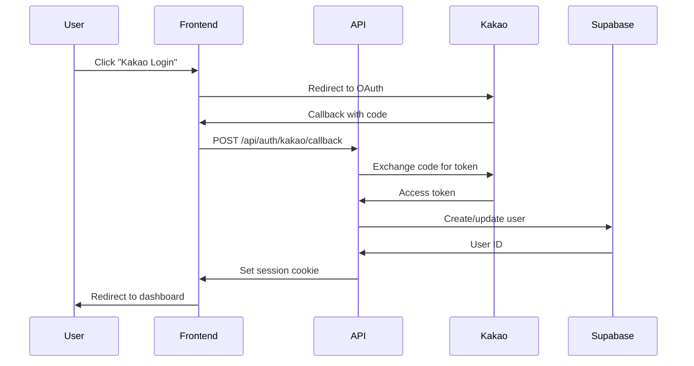

# API Reference - Secret Saju

**Complete API Documentation**

---

## 📋 Overview

Secret Saju uses RESTful API endpoints built with Next.js App Router. All endpoints return JSON and require authentication unless specified.

**Base URL**: `https://secretsaju.com/api` (Production)  
**Dev URL**: `http://localhost:3000/api`

---

## 🔐 Authentication

All API requests (except auth endpoints) require a valid session cookie obtained through Kakao Login.

### Authentication Flow



### Headers
```http
Cookie: secret-saju-session=<JWT_TOKEN>
Content-Type: application/json
```

---

## 📍 Endpoints

### Saju Calculation

#### `POST /api/saju/calculate`
Calculate high-precision saju (Four Pillars).

**Request Body**:
```typescript
{
  birthDate: string;      // ISO 8601, e.g. "1990-01-15T00:00:00Z"
  birthTime: string;      // "HH:mm", e.g. "14:30"
  gender: "M" | "F";
  calendarType?: "solar" | "lunar";  // Default: "solar"
  location?: {
    latitude: number;
    longitude: number;
    timezone: string;
  };
}
```

**Response** (200 OK):
```typescript
{
  fourPillars: {
    year: { stem: "甲", branch: "子" },
    month: { stem: "乙", branch: "丑" },
    day: { stem: "丙", branch: "寅" },
    hour: { stem: "丁", branch: "卯" }
  },
  trueSolarTime: "1990-01-15T14:32:15Z",
  gender: "M",
  elements: {
    wood: 2, fire: 1, earth: 0, metal: 1, water: 0
  },
  sinsal: [...],
  sipsong: {...},
  gyeokguk: {...},
  daewun: {...}
}
```

**Errors**:
- `400 Bad Request`: Invalid input (future date, missing fields)
- `401 Unauthorized`: No session
- `500 Internal Server Error`: Calculation failed

**Example**:
```bash
curl -X POST https://secretsaju.com/api/saju/calculate \
  -H "Content-Type: application/json" \
  -H "Cookie: secret-saju-session=..." \
  -d '{
    "birthDate": "1990-01-15T00:00:00Z",
    "birthTime": "14:30",
    "gender": "M",
    "calendarType": "solar"
  }'
```

---

### Profile Management

#### `POST /api/saju/create`
Save a saju profile to user's account.

**Request Body**:
```typescript
{
  name: string;          // "나", "엄마", etc.
  relationship: "self" | "spouse" | "child" | "parent" | "friend" | "lover" | "other";
  birthdate: string;     // "YYYY-MM-DD"
  birthTime?: string;    // "HH:mm"
  isTimeUnknown?: boolean;
  calendarType: "solar" | "lunar";
  gender: "female" | "male";
}
```

**Response** (201 Created):
```typescript
{
  id: "uuid",
  userId: "uuid",
  name: "나",
  relationship: "self",
  birthdate: "1990-01-15",
  birthTime: "14:30",
  calendarType: "solar",
  gender: "female",
  createdAt: "2026-01-31T12:00:00Z",
  updatedAt: "2026-01-31T12:00:00Z"
}
```

#### `GET /api/saju/list`
Get all saved profiles for authenticated user.

**Response** (200 OK):
```typescript
{
  profiles: [
    {
      id: "uuid",
      name: "나",
      relationship: "self",
      birthdate: "1990-01-15",
      ...
    }
  ],
  total: 3
}
```

#### `DELETE /api/saju/delete?id=<profile_id>`
Delete a saved profile.

**Response** (200 OK):
```typescript
{
  success: true,
  deletedId: "uuid"
}
```

---

### Payment & Wallet

#### `POST /api/payment/verify`
Verify a Toss payment and credit jellies.

**Request Body**:
```typescript
{
  paymentKey: string;
  orderId: string;
  amount: number;  // In KRW
}
```

**Response** (200 OK):
```typescript
{
  success: true,
  jellies: 3,
  transactionId: "uuid",
  newBalance: 10
}
```

#### `GET /api/wallet/balance`
Get user's current jelly balance.

**Response** (200 OK):
```typescript
{
  userId: "uuid",
  balance: 7,
  totalPurchased: 10,
  totalConsumed: 3
}
```

#### `GET /api/wallet/history`
Get transaction history.

**Response** (200 OK):
```typescript
{
  transactions: [
    {
      id: "uuid",
      type: "purchase" | "consume" | "gift",
      jellies: 3,
      amount: 2900,
      purpose: "SMART 패키지 구매",
      createdAt: "2026-01-31T10:00:00Z"
    }
  ],
  total: 5
}
```

---

### Recommendations

#### `GET /api/recommendations?code=<ganji_code>&age_group=<20s|30s|40s>`
Get personalized food/product recommendations based on saju.

**Response** (200 OK):
```typescript
{
  code: "甲子",
  ageGroup: "20s",
  food: [
    {
      name: "녹차",
      reason: "木 기운 강화",
      emoji: "🍵"
    }
  ],
  products: [
    {
      name: "숲 테라피 향수",
      category: "향수",
      reason: "木 element 보충",
      emoji: "🌲",
      link: "https://..."
    }
  ]
}
```

---

### Miscellaneous

#### `GET /api/daily-fortune?profileId=<uuid>`
Get today's fortune for a saved profile.

**Response** (200 OK):
```typescript
{
  fortune: "오늘은 재물운이 좋은 날입니다...",
  date: "2026-01-31"
}
```

#### `GET /api/celebrity-match?profileId=<uuid>`
Find celebrities with similar saju.

**Response** (200 OK):
```typescript
{
  matches: [
    {
      name: "아이유",
      code: "甲子",
      description: "...",
      match Percentage: 85,
      matchReason: "..."
    }
  ]
}
```

---

## 🚨 Error Handling

All errors follow this structure:

```typescript
{
  error: {
    code: string;        // "VALIDATION_ERROR", "AUTH_REQUIRED", etc.
    message: string;     // Human-readable Korean message
    details?: unknown;   // Additional info (dev mode only)
  }
}
```

### Common Error Codes

| Code | HTTP Status | Meaning |
|------|-------------|---------|
| `VALIDATION_ERROR` | 400 | Invalid input |
| `AUTH_REQUIRED` | 401 | Not logged in |
| `FORBIDDEN` | 403 | No permission |
| `NOT_FOUND` | 404 | Resource doesn't exist |
| `PAYMENT_ERROR` | 402 | Payment failed |
| `RATE_LIMIT` | 429 | Too many requests |
| `INTERNAL_ERROR` | 500 | Server error |

---

## 📊 Rate Limiting

| Endpoint | Limit | Window |
|----------|-------|--------|
| `/api/saju/calculate` | 60 requests | 1 minute |
| `/api/saju/create` | 10 requests | 1 minute |
| `/api/payment/*` | 5 requests | 1 minute |
| All others | 120 requests | 1 minute |

**Exceeded**: Returns 429 with `Retry-After` header.

---

## 🧪 Testing

### Development
```bash
# Use localhost
curl http://localhost:3000/api/saju/calculate \
  -H "Content-Type: application/json" \
  -d '{"birthDate": "1990-01-15T00:00:00Z", "birthTime": "14:30", "gender": "M"}'
```

### Postman Collection
**Download**: [secret-saju-api.postman_collection.json](../../06-resources/api-collection.json)

---

## 📚 Related Documentation

- [API Type Definitions](../../../src/types/api.ts)
- [Error Handling](../../../src/lib/contracts/errors.ts)
- [Authentication Flow](../integrations/kakao-login.md)
- [Payment Integration](../integrations/toss-payments.md)

---

**Document Owner**: Backend Team  
**Last Updated**: 2026-01-31  
**API Version**: 1.0

