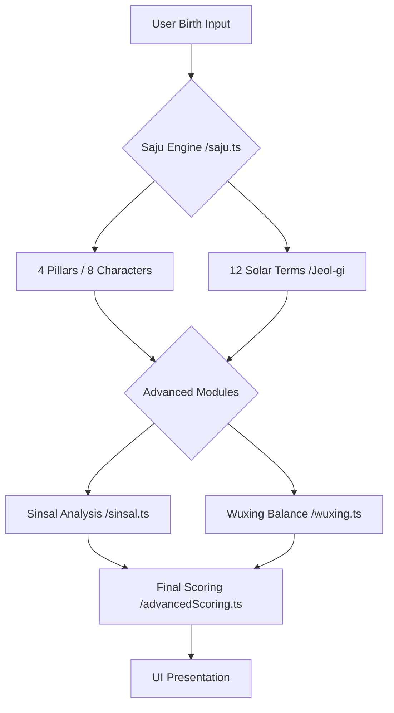
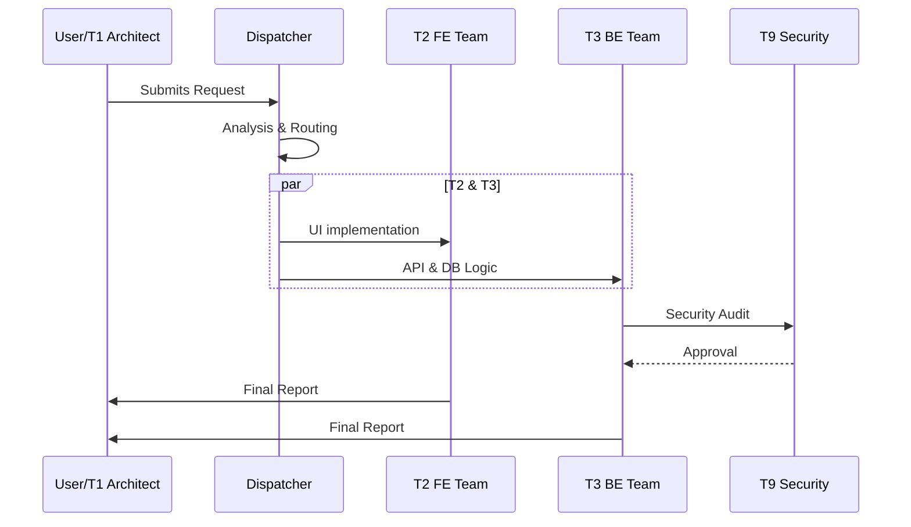

# Secret Saju Architecture Overview

## 1. System Layers `#layers`

| Layer | Responsibility | Key Components |
|-------|---------------|----------------|
| **Core Engine** | High-precision Saju calculations | `saju.ts`, `sinsal.ts`, `wuxing.ts`, `terminology.ts` |
| **Data Service** | Data persistence & Real-time sync | Supabase (Postgres), `supabase.ts`, `storage.ts` |
| **AI Intelligence** | Multi-LLM persona routing | `persona-matrix.ts`, `ai-routing.ts`, `/api/persona` |
| **Crawler Layer** | External campaign data extraction | `DinnerQueenAdapter.ts`, `RevuAdapter.ts` |
| **Business Logic** | Feature-specific rules & Auth | `payment.ts`, `referrals.ts`, `kakao-auth.ts`, `jelly-wallet.ts` |
| **UI/UX Layer** | Interactive & Premium presentation | Next.js App Router, Framer Motion, `globals.css` |
| **Context Efficiency** | Multi-AI anti-hallucination | `AI_BOOTSTRAP.md`, `ERROR_LEDGER.md`, `CONTEXT_ENGINE.md §4` |
| **Ops/Management** | Agent orchestration & Error tracking | `ERROR_CATALOG.md`, 10-Team Agent System |

---

## 2. Data Flow `#dataflow`

### 🔮 Saju Calculation Flow
1. **Input**: User Birth Date/Time.
2. **Engine**: `saju.ts` (Wave 5) computes 4 Pillars, 8 Characters, 12 Jeol-gi (Solar Terms).
3. **Advanced**: `sinsal.ts` expands to 10+ Sinsal (Gods/Killers), `wuxing.ts` analyzes Five Elements balance.
4. **Scoring**: `advancedScoring.ts` generates Daily/Yearly scores.

### 💳 Payment & Wallet Flow
1. **Request**: `payment.ts` initiates Toss Payments widget.
2. **Verify**: `/api/payment/verify` checks status & logs to Notion.
3. **Credit**: `jelly-wallet.ts` updates user balance on verify success.

### 🕷️ Crawler Integration
1. **Trigger**: Background worker or Manual sync.
2. **Adapter**: `RevuAdapter` / `DinnerQueenAdapter` fetches campaigns.
3. **Sync**: Data normalized to `campaign.ts` types and stored in Supabase.

---

## 3. Agent Coordination `#agents`

Secret Saju uses a **10-Team Agent Architecture** for parallelization.

---

---

## 4. Design Principles `#principles`
- **Minimalism**: Clean code, pure functions in core.
- **Immersive UX**: Glassmorphism, subtle micro-animations (Framer Motion).
- **Zero-Error Policy**: `npm run qa` must pass (TSC/Lint/Contract) before any merge.
