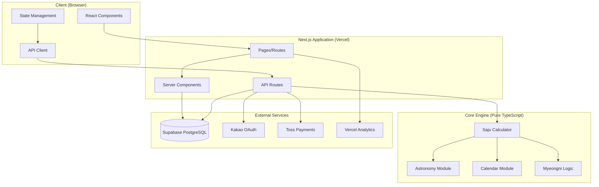
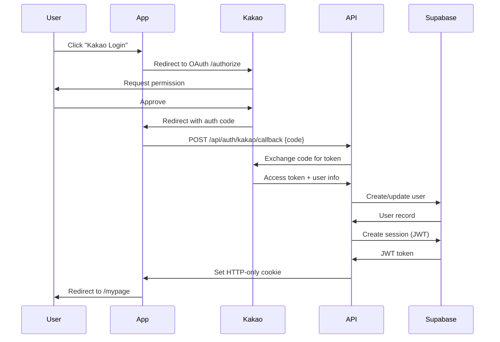

# Architecture Overview - Secret Saju

**System Design & Technical Architecture**

---

## 🎯 Architecture Principles

### 1. **Serverless-First**
- No server management
- Auto-scaling
- Pay-per-use

### 2. **Separation of Concerns**
```
Presentation Layer (UI)
       ↓
Business Logic Layer (API + Core Engine)
       ↓
Data Layer (Supabase)
```

### 3. **Type-Safe End-to-End**
- TypeScript on frontend + backend
- Supabase generated types
- No runtime type errors

---

## 🏗️ High-Level Architecture



---

## 📦 Layer Breakdown

### 1. **Presentation Layer** (Frontend)

**Technology**: React 18 + Next.js 14 App Router

**Responsibilities**:
- User interface rendering
- Form validation (client-side)
- State management
- API communication

**Key Components**:
```
src/app/
├── page.tsx                 # Landing page
├── mypage/                  # User dashboard
├── result/                  # Saju result display
└── layout.tsx               # Root layout (nav, theme)

src/components/
├── ui/                      # Reusable UI (Button, Input)
├── birth-input-form.tsx     # Birth info input
├── result-card.tsx          # Saju display
└── secret-paws-flow.tsx     # Main wizard flow
```

---

### 2. **API Layer** (Backend)

**Technology**: Next.js API Routes (Serverless Functions)

**Responsibilities**:
- Request validation
- Authentication/authorization
- Business logic orchestration
- External service integration

**Key Endpoints**:
```
src/app/api/
├── saju/
...   ├── calculate/route.ts      # POST: Calculate saju
│   ├── create/route.ts          # POST: Save profile
│   ├── list/route.ts            # GET: List profiles
│   └── delete/route.ts          # DELETE: Remove profile
├── auth/
│   └── kakao/
│       ├── login/route.ts       # Initiate OAuth
│       └── callback/route.ts    # Handle callback
├── payment/
│   └── verify/route.ts          # POST: Verify payment
└── wallet/
    ├── balance/route.ts         # GET: Jelly balance
    └── history/route.ts         # GET: Transaction history
```

**Data Flow Example** (Saju Calculation):
```
Client Form
  ↓ POST /api/saju/calculate
API Route (route.ts)
  ↓ Validate input
  ↓ Check authentication
  ↓ Call Core Engine
Saju Engine
  ↓ Calculate Four Pillars
  ↓ Return result
API Route
  ↓ Format response
  ↓ Send JSON
Client
  ↓ Render result
```

---

### 3. **Core Business Logic** (Saju Engine)

**Technology**: Pure TypeScript (no framework dependencies)

**Responsibilities**:
- High-precision saju calculation
- Astronomical calculations
- Calendar conversions
- Myeongni analysis

**Architecture**:
```
src/core/
├── api/
│   └── saju-engine.ts           # Main calculation orchestrator
├── astronomy/
│   ├── solar-term.ts            # 24 solar terms
│   ├── true-solar-time.ts       # Longitude correction
│   └── summer-time.ts           # Korea DST (1948-1988)
├── calendar/
│   ├── ganji.ts                 # 60 Ganji calculation
│   ├── lunar-solar.ts           # Lunar ↔ Solar conversion
│   └── four-pillars.ts          # Year/Month/Day/Hour pillars
└── myeongni/
    ├── elements.ts              # Five Elements (오행)
    ├── sipsong.ts               # Ten Gods (십성)
    ├── sinsal.ts                # Special Stars (신살)
    ├── gyeokguk.ts              # Formations (격국)
    └── daewun.ts                # Luck Periods (대운)
```

**Key Algorithm Flow**:
```typescript
// High-level pseudocode
function calculateSaju(input: SajuInput): SajuResult {
  // 1. Parse input date
  const date = parseDate(input.birthDate, input.calendarType);
  
  // 2. Apply summer time if applicable
  if (isSummerTimePeriod(date)) {
    date.addHours(1);
  }
  
  // 3. Convert lunar to solar if needed
  if (input.calendarType === 'lunar') {
    date = lunarToSolar(date);
  }
  
  // 4. Calculate True Solar Time
  const trueSolarTime = getTrueSolarTime(date, input.location);
  
  // 5. Calculate Four Pillars
  const fourPillars = {
    year: getYearPillar(trueSolarTime),
    month: getMonthPillar(trueSolarTime),
    day: getDayPillar(trueSolarTime),
    hour: getHourPillar(trueSolarTime)
  };
  
  // 6. Perform Myeongni analysis
  const elements = analyzeElements(fourPillars);
  const sipsong = analyzeSipsong(fourPillars, input.gender);
  const sinsal = analyzeSinsal(fourPillars);
  const gyeokguk = analyzeGyeokguk(fourPillars);
  const daewun = calculateDaewun(fourPillars, input.birthDate);
  
  return {
    fourPillars,
    trueSolarTime,
    elements,
    sipsong,
    sinsal,
    gyeokguk,
    daewun
  };
}
```

---

### 4. **Data Layer** (Database)

**Technology**: Supabase (PostgreSQL 15)

**Schema**:
```sql
-- User accounts (via Kakao OAuth)
CREATE TABLE users (
  id UUID PRIMARY KEY DEFAULT gen_random_uuid(),
  kakao_id BIGINT UNIQUE NOT NULL,
  email TEXT,
  name TEXT,
  profile_image TEXT,
  created_at TIMESTAMPTZ DEFAULT NOW()
);

-- Saved saju profiles
CREATE TABLE saju_profiles (
  id UUID PRIMARY KEY DEFAULT gen_random_uuid(),
  user_id UUID REFERENCES users(id) ON DELETE CASCADE,
  name TEXT NOT NULL,
  relationship TEXT,  -- 'self', 'spouse', 'child', etc.
  birthdate DATE NOT NULL,
  birth_time TIME,
  is_time_unknown BOOLEAN DEFAULT FALSE,
  calendar_type TEXT NOT NULL,  -- 'solar' or 'lunar'
  gender TEXT NOT NULL,  -- 'male' or 'female'
  created_at TIMESTAMPTZ DEFAULT NOW()
);

-- Jelly wallet
CREATE TABLE jelly_wallets (
  user_id UUID PRIMARY KEY REFERENCES users(id) ON DELETE CASCADE,
  balance INTEGER DEFAULT 0,
  total_purchased INTEGER DEFAULT 0,
  total_consumed INTEGER DEFAULT 0
);

-- Transaction history
CREATE TABLE jelly_transactions (
  id UUID PRIMARY KEY DEFAULT gen_random_uuid(),
  user_id UUID REFERENCES users(id) ON DELETE CASCADE,
  type TEXT NOT NULL,  -- 'purchase', 'consume', 'gift'
  jellies INTEGER NOT NULL,
  amount INTEGER,  -- KRW (for purchases)
  purpose TEXT,
  created_at TIMESTAMPTZ DEFAULT NOW()
);

-- Feature unlocks
CREATE TABLE unlocks (
  id UUID PRIMARY KEY DEFAULT gen_random_uuid(),
  user_id UUID REFERENCES users(id) ON DELETE CASCADE,
  profile_id UUID REFERENCES saju_profiles(id) ON DELETE CASCADE,
  feature TEXT NOT NULL,  -- 'detailed_analysis', 'compatibility', etc.
  created_at TIMESTAMPTZ DEFAULT NOW()
);

-- Customer inquiries
CREATE TABLE inquiries (
  id UUID PRIMARY KEY DEFAULT gen_random_uuid(),
  user_id UUID REFERENCES users(id),
  email TEXT,
  category TEXT,  -- 'payment', 'bug', 'feature', etc.
  subject TEXT NOT NULL,
  message TEXT NOT NULL,
  status TEXT DEFAULT 'pending',  -- 'pending', 'answered', 'closed'
  created_at TIMESTAMPTZ DEFAULT NOW()
);
```

**Row Level Security (RLS)**:
```sql
-- Users can only access their own data
ALTER TABLE saju_profiles ENABLE ROW LEVEL SECURITY;

CREATE POLICY "Users can view own profiles"
  ON saju_profiles FOR SELECT
  USING (auth.uid() = user_id);

CREATE POLICY "Users can insert own profiles"
  ON saju_profiles FOR INSERT
  WITH CHECK (auth.uid() = user_id);

CREATE POLICY "Users can delete own profiles"
  ON saju_profiles FOR DELETE
  USING (auth.uid() = user_id);
```

---

## 🔐 Security Architecture

### Authentication Flow



### Security Layers

1. **HTTPS Only**: All traffic encrypted (TLS 1.3)
2. **HTTP-Only Cookies**: XSS protection
3. **CSRF Protection**: Built-in Next.js (SameSite cookies)
4. **RLS (Row Level Security)**: Database-level access control
5. **Input Validation**: Zod schemas on API routes
6. **Rate Limiting**: Vercel Edge Functions (future)

---

## 🚀 Deployment Architecture

### Hosting: **Vercel**

```
Git Push (main branch)
  ↓
Vercel Build
  ├─ TypeScript compilation
  ├─ ESLint checks
  ├─ Unit tests
  └─ Next.js build
  ↓
Deploy to Edge Network
  ├─ Global CDN (150+ locations)
  ├─ Automatic HTTPS
  └─ Instant rollback
  ↓
Production Live ✅
```

**Environments**:
- **Production**: `secretsaju.com` (from `main` branch)
- **Staging**: `dev.secretsaju.com` (from `dev` branch)
- **Preview**: Auto-generated URL for each PR

---

### CI/CD Pipeline

```yaml
# .github/workflows/ci.yml (conceptual)
name: CI

on: [push, pull_request]

jobs:
  test:
    runs-on: ubuntu-latest
    steps:
      - Checkout code
      - Install dependencies
      - Run TypeScript check
      - Run ESLint
      - Run unit tests
      - Build Next.js app
      - (Future) Run E2E tests
```

---

## 📊 Performance Architecture

### Optimization Strategies

1. **Server Components** (Next.js 14)
   - Reduce client-side JavaScript
   - Faster initial load

2. **Code Splitting**
   - Automatic by Next.js
   - Each route is a separate bundle

3. **Image Optimization**
   - `next/image` component
   - WebP format, lazy loading

4. **Caching Strategy** (Future)
   ```
   CDN (Vercel Edge)
     ↓ Cache static assets (1 year)
   Redis/Upstash
     ↓ Cache API responses (15 min)
   Supabase
     ↓ Database queries
   ```

5. **Database Indexes**
   ```sql
   CREATE INDEX idx_profiles_user ON saju_profiles(user_id);
   CREATE INDEX idx_transactions_user ON jelly_transactions(user_id);
   ```

---

## 🔄 Data Flow Examples

### Example 1: User Calculates Saju

```
1. User enters birth info → BirthInputForm.tsx
2. Client validates input → Zod schema
3. Submit → POST /api/saju/calculate
4. API route validates → Check session cookie
5. Call SajuEngine.calculate()
   ├─ Parse date
   ├─ Apply summer time
   ├─ Convert lunar to solar (if needed)
   ├─ Calculate True Solar Time
   ├─ Calculate Four Pillars
   └─ Perform Myeongni analysis
6. Return JSON response
7. Client renders → ResultCard.tsx
```

### Example 2: User Buys Jellies

```
1. User clicks "Buy Jellies"
2. Select package (TRIAL/SMART/PRO)
3. Toss Payments widget opens
4. User completes payment
5. Toss redirects → /payment/success?paymentKey=xxx
6. Client → POST /api/payment/verify {paymentKey, orderId, amount}
7. API calls Toss API → Confirm payment
8. Toss confirms → Payment successful
9. API → INSERT INTO jelly_transactions
10. API → UPDATE jelly_wallets SET balance = balance + jellies
11. Return success → Client shows "Charged!" toast
```

---

## 🛠️ Development Workflow

### Local Development

```bash
# 1. Clone repo
git clone https://github.com/secret-paws/SecretSaju.git

# 2. Install dependencies
npm install

# 3. Setup .env.local (see QUICK_START.md)
cp .env.local.template .env.local

# 4. Run dev server
npm run dev
# → http://localhost:3000

# 5. Run tests (separate terminal)
npm run test:watch
```

### Code Review Process

```
Developer → Feature Branch
  ↓
Create PR on GitHub
  ↓
Automated checks (CI)
  ├─ TypeScript ✓
  ├─ ESLint ✓
  ├─ Tests ✓
  └─ Build ✓
  ↓
Code review (1+ approval required)
  ↓
Merge to dev branch
  ↓
Deploy to staging → QA test
  ↓
Merge to main → Production deploy
```

---

## 📈 Scalability Considerations

### Current Capacity
- **Users**: 10K MAU (easily handles)
- **Database**: < 1GB (Supabase Free tier)
- **API QPS**: ~10 (no issues)

### Scaling Plan

| MAU | Infrastructure | Cost/Month |
|-----|---------------|-----------|
| **10K** | Free tier | $0 |
| **50K** | Supabase Pro | $25 |
| **100K** | + Upstash Redis | $75 |
| **500K** | + Load balancer | $500 |
| **1M+** | Microservices? | $2,000+ |

### Bottleneck Analysis

**Potential Bottlenecks**:
1. **Database**: Supabase free tier (500 MB storage, 2 GB bandwidth)
   - **Solution**: Upgrade to Pro ($25/month) at 20K MAU
   
2. **API Rate Limits**: None currently (Vercel scales automatically)
   - **Monitor**: Response times, error rates

3. **Calculation Performance**: Saju engine is CPU-intensive
   - **Current**: 200-500ms per calculation (acceptable)
   - **Future**: Consider caching common birthdate patterns

---

## 🔍 Monitoring & Observability

### Current Setup
- **Vercel Analytics**: Speed Insights, Web Vitals
- **Google Analytics 4**: User behavior, conversions
- **Supabase Logs**: Database queries, errors

### Future Setup (Q2-Q3)
- **Sentry**: Error tracking, crash reports
- **LogRocket**: Session replay for debugging
- **Datadog** (if needed): Full stack observability

---

## 📚 Related Documentation

- [CTO Technical Strategy](../01-team/c-level/cto-technical-strategy.md)
- [API Reference](./api/README.md)
- [Database Schema](./database-schema.md) (To be created)
- [Security Architecture](./security-architecture.md) (To be created)

---

**Document Owner**: CTO / Solution Architect  
**Last Updated**: 2026-01-31  
**Next Review**: Quarterly or when major architecture changes
